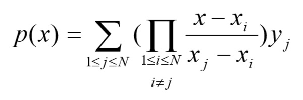

# Interpolacion de Lagrange

## Como usar el programa
-  Este es un simple programa de Interpolacion usando el metodo de Lagrange
Las instrucciones para utilizarlo son muy simples:
- Solo llena los espacios en blanco con los datos correspondientes y pulsa el boton "Resolver"